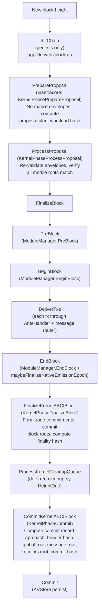
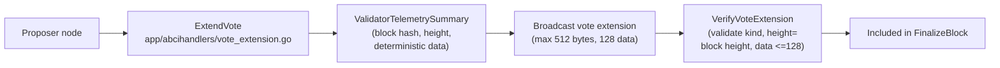
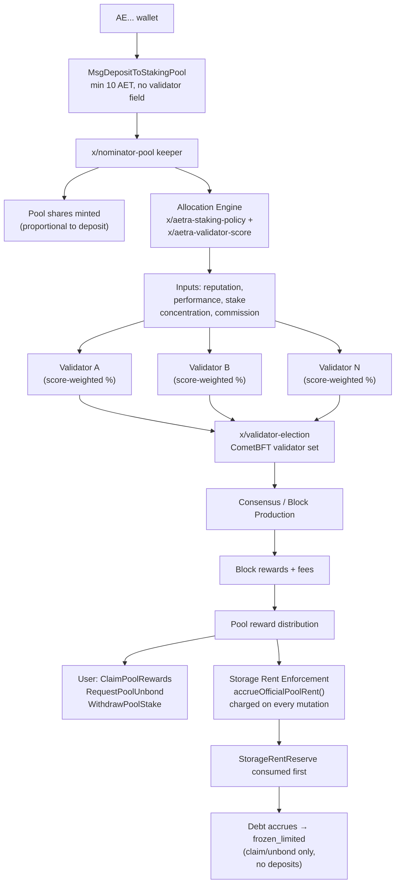
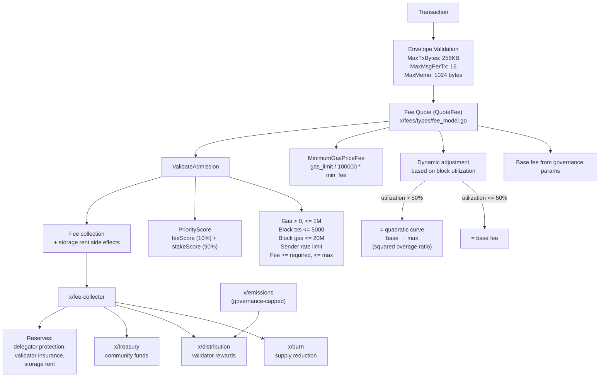
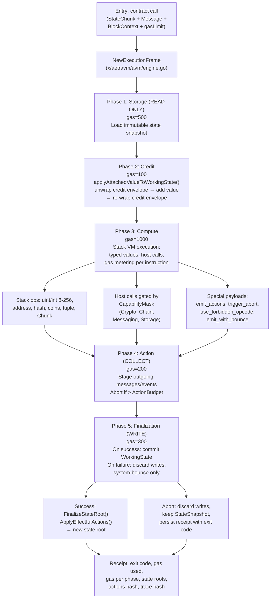
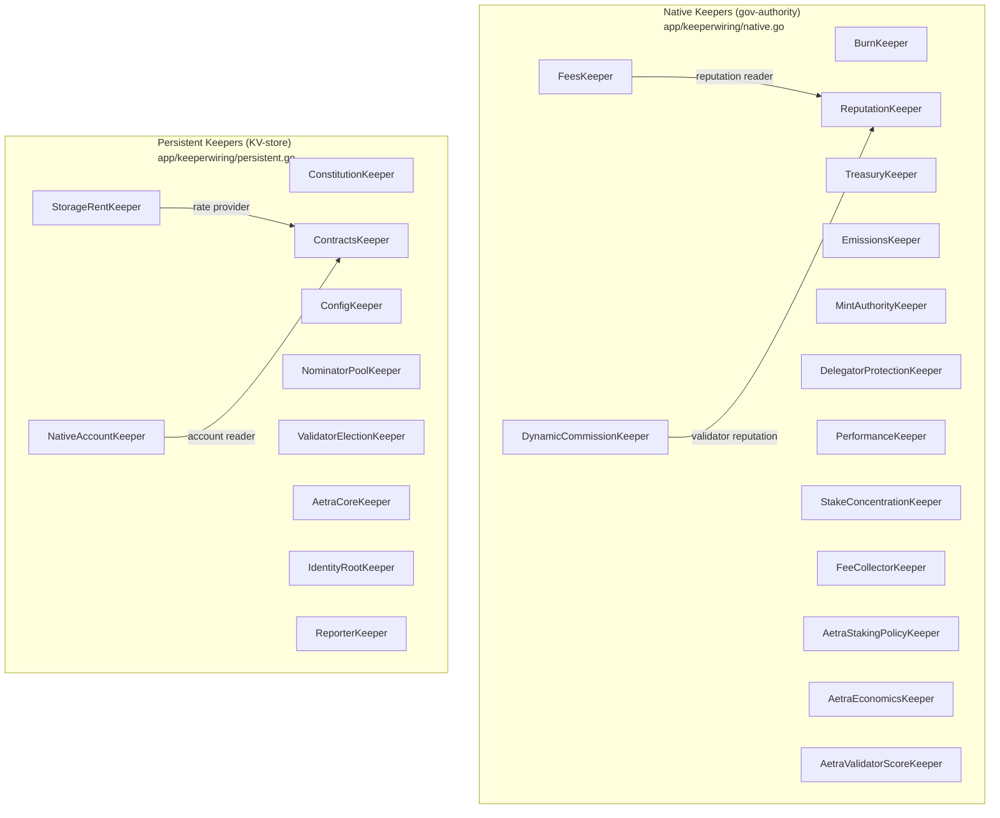
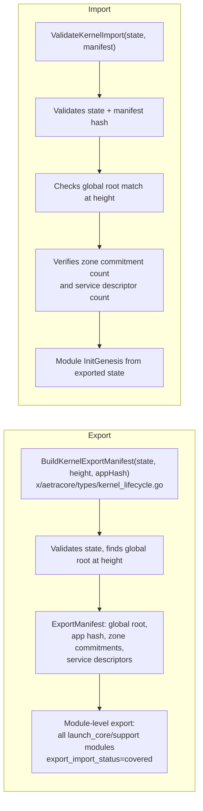

# Aetra Blockchain

Aetra is a sovereign Cosmos SDK Layer 1 blockchain — a deterministic, account-based PoS chain with an embedded Aetra Virtual Machine (AVM) for smart contracts. Built for moderate hardware, pool-based staking with no direct user→validator delegation, and governance-controlled economics with deterministic fee admission.

| Property | Value |
|----------|-------|
| Native asset | **AET** (1 AET = 10⁹ naet) |
| Consensus | CometBFT (2–5s blocks) |
| VM | AVM v1 — stack-based, typed, deterministic |
| Staking | Pool-based, no direct user→validator choice |
| Fee target | ~0.01 AET per transfer (governance-adjustable) |
| Address format | User: `AE...` / Raw: `4:...` / Protocol: `-7:...` |

## Quick Start

```powershell
.\scripts\build-aetrad.ps1
.\scripts\localnet\init.ps1 -ChainId aetra-local-1 -ValidatorCount 3
.\scripts\localnet\start.ps1 -ChainId aetra-local-1
.\scripts\testnet\public-testnet-readiness-report.ps1
.\scripts\testnet\public-testnet-preflight.ps1 -ValidatorProfile All
```

No external dependencies — just the binary and CometBFT.

---

## Transaction Pipeline (End-to-End)

```mermaid
flowchart LR
  CLIENT["CLI / REST / gRPC / RPC"]
  CLIENT --> MEMPOOL["CometBFT Mempool<br/>tx gossiped among peers"]
  MEMPOOL --> PREPARE["PrepareProposal<br/>(x/aetracore kernel:<br/>select txs, build schedule,<br/>validate gas limits)"]
  PREPARE --> VOTE_EXTEND["ExtendVote<br/>(validator telemetry,<br/>oracle, encrypted mempool)"]
  VOTE_EXTEND --> VOTE_VERIFY["VerifyVoteExtension<br/>(validate kind, height,<br/>hash, deterministic data)"]
  VOTE_VERIFY --> FINALIZE["FinalizeBlock"]
  FINALIZE --> PREBLOCK["PreBlock<br/>(upgrade handlers, auth)"]
  PREBLOCK --> BEGINBLOCK["BeginBlock<br/>(epoch tracking,<br/>distribution begin)"]
  BEGINBLOCK --> ANTE["AnteHandler<br/>(signatures, sequence,<br/>fee payer, reserved addr)"]
  ANTE --> FEES["x/fees: ValidateAdmission<br/>gas limit, block gas,<br/>rate limit, fee >= dynamic quote"]
  FEES --> ROUTER["SDK Message Router"]
  ROUTER --> SDK_MODULES["SDK Base: auth, bank,<br/>staking, slashing,<br/>distribution, mint, gov"]
  ROUTER --> AETRA_MODULES["Aetra Modules:<br/>economy, validator systems,<br/>AVM, identity, config"]
  SDK_MODULES --> ENDBLOCK["EndBlock<br/>(validator election,<br/>emissions, performance)"]
  AETRA_MODULES --> ENDBLOCK
  ENDBLOCK --> KERNEL_ABCI["x/aetracore kernel phases:<br/>FinalizeKernelABCIBlock<br/>CommitKernelABCIBlock"]
  KERNEL_ABCI --> COMMIT["Commit<br/>(app hash, state root,<br/>message root, receipts root)"]
  COMMIT --> EXPORT["Genesis Export / Import<br/>deterministic roundtrip"]
```



---

## Block Lifecycle



### Vote Extension Flow



---

## Staking & Validator Set

Users never choose a validator. All deposits go into the official nominator pool, which allocates to validators by deterministic weights:



- `MsgDepositToStakingPool` has no validator field — rejected at validation
- `MsgDelegate` disabled for normal user path
- Validator minimum self-stake: 1,000,000 AET (solo) / 400,000 AET (pool-backed)
- Pool minimum deposit: 10 AET
- Unbonding period: 18 days (governance-adjustable)

---

## Fee Economy

Every transaction pays a deterministic fee through a dynamic admission pipeline:



**Default fee parameters:** min_tx_fee = 0.003 AET, target transfer = 0.01 AET, target utilization = 50%, congestion threshold = 80%, max sender txs/block with stake = 250.

---

## AVM Smart Contract Execution



- Content-addressed immutable Chunks (≤2048 data bits, ≤8 refs)
- Typed values: uint/int 8–256, address, hash, coins, tuple, Chunk
- Deterministic: same code/state/message → same exit code, gas, receipt, root
- Get methods are read-only, no state mutation
- Storage rent enforced before contract execution

---

## Storage Rent

Storage rent is enforced at **four layers** in every transaction path:

```mermaid
flowchart TD
  subgraph LAYER_A["Layer A: Fee Admission"]
    A1["x/fees: EffectiveWalletFee()<br/>gasFee + storageRentDelta + unpaidDebt"]
    A1 --> A2["Collected → feecollector_storage_rent_reserve"]
  end

  subgraph LAYER_B["Layer B: Contract Access"]
    B1["x/storage-rent/keeper<br/>TrackContractStorageUsage()"]
    B1 --> B2["PayStorageRent()<br/>(user-initiated debt payment)"]
    B1 --> B3["FreezeExpiredContract()<br/>debt > 0 && active → frozen"]
    B3 --> B4["UnfreezeContract()<br/>full debt + buffer payment"]
    B3 --> B5["DeleteExpiredContract()<br/>after retention period"]
  end

  subgraph LAYER_C["Layer C: Pool Mutation"]
    C1["accrueOfficialPoolRent()<br/>x/nominator-pool/keeper"]
    C1 --> C2["elapsed_blocks ×<br/>storage_footprint ×<br/>rate_per_byte_second"]
    C2 --> C3["StorageRentReserve consumed first"]
    C3 --> C4["Debt → frozen_limited<br/>(no deposits, no injection)"]
  end

  subgraph LAYER_D["Layer D: System Reserve"]
    D1["ComputeSystemRentAccounting()<br/>x/storage-rent/types/policy.go"]
    D1 --> D2["Warning → Critical → Invariant<br/>three-tier alert system"]
    D2 --> D3["Top-up chain:<br/>FeeCollector → Treasury<br/>→ Governance payer"]
  end

  subgraph STATE_CLASSES["State Subject Lifecycle"]
    S1["Classes: wallet, contract,<br/>pool_contract, pool_share,<br/>pool_allocation, pool_reward_index,<br/>pool_unbonding, domain_record,<br/>staking_reputation,<br/>system_module, validator_record"]
    S1 --> S2["Protocol-critical / system-module<br/>/ validator: never frozen"]
    S1 --> S3["Official pool with debt:<br/>frozen_limited"]
    S1 --> S4["Regular subject with debt:<br/>fully frozen"]
  end
```



- Storage rent rate: 1 naet per byte-second (governance-adjustable)
- Pool storage footprint: base 160 + pool IDs + shares (48B each) + unbondings (56B each) + allocations (40B each)

---

## Module Architecture

### Launch Core (14 modules — consensus-critical for testnet)

| Module | Purpose |
|--------|---------|
| `x/burn` | Burn accounting for AET/naet fees and emissions |
| `x/contracts` | AVM contract state and contract-owned application assets |
| `x/delegator-protection` | Pool-only staking protection and delegation safety |
| `x/emissions` | Governance-capped emissions policy |
| `x/fee-collector` | Deterministic fee collection and distribution |
| `x/fees` | Dynamic fee admission, spam limits, naet fee policy |
| `x/mint-authority` | Governance-controlled mint authority |
| `x/native-account` | AE account state, auth/freeze/rent, address boundaries |
| `x/nominator-pool` | Official pool staking accounting, direct-delegation guardrails |
| `x/single-nominator-pool` | Alternative pool model accounting |
| `x/storage-rent` | Storage rent/debt accounting and system reserves |
| `x/treasury` | Community allocation accounting |
| `x/validator-election` | Validator set election from pool allocations |
| `x/validator-registry` | Validator metadata, admission, ownership |

### Launch Support (24 modules — non-consensus-critical, runtime surface)

| Module | Purpose |
|--------|---------|
| `x/actor-registry` | AVM actor identities and contract routing metadata |
| `x/aetracore` | Core-zone coordination with kernel ABCI lifecycle |
| `x/aetra-economics` | Governance-owned economic policy calculations |
| `x/aetra-staking-policy` | Pool/validator allocation policy calculations |
| `x/aetra-validator-score` | Deterministic validator score calculation |
| `x/avm-scheduler` | AVM scheduling state for contract execution |
| `x/bridge-hub` | Bridge coordination registry (feature-gated) |
| `x/config` | Governance-backed runtime configuration |
| `x/config-voting` | Config voting for parameter changes |
| `x/constitution` | Governance constitution, launch policy registry |
| `x/cross-chain-registry` | Cross-chain metadata registry (feature-gated) |
| `x/dynamic-commission` | Validator commission policy surface |
| `x/evidence` | Native evidence records and reporter integration |
| `x/identity-root` | Root identity policy and reserved-name state |
| `x/load` | Load profile inputs for fee/routing policy |
| `x/mesh` | Mesh coordination surface (feature-gated) |
| `x/networking` | Networking policy and metadata (feature-gated) |
| `x/payments` | Payment-channel coordination (feature-gated) |
| `x/performance` | Validator performance telemetry |
| `x/reporter` | Reporter rewards for evidence and telemetry |
| `x/reputation` | Bounded fee/priority/allocation reputation inputs |
| `x/routing` | Routing surface (sharding feature-gated) |
| `x/scheduler` | Protocol scheduler state (feature-gated) |
| `x/sharding-coordinator` | Sharding coordination metadata (feature-gated) |
| `x/system-registry` | System entity registry, protocol-critical boundaries |
| `x/validator-insurance` | Validator insurance accounting |
| `x/zones` | Core-zone metadata (feature-gated) |

### Not Wired (future AVM standards, prototypes, disabled)

- **Future AVM standard** (15): `x/actors`, `x/aetravm`, `x/compute`, `x/execution`, `x/identity`, `x/market`, `x/memo`, `x/messages`, `x/messaging`, `x/permissions`, `x/proofregistry`, `x/queue`, `x/storage`, `x/vm`, `x/workflow`
- **Prototype only** (7): `x/epoch`, `x/events`, `x/indexer`, `x/pos`, `x/services`, `x/taskgroups`, `x/validator-economy`
- **Disabled**: `x/sharding`

No native token/NFT/DEX modules — all application-level assets belong in AVM contracts (AFT-44, ANFT-66).

---

## Keeper Wiring Architecture



- Native keepers: constructed with `NewKeeper(authority)`, governance-authority pattern
- Persistent keepers: constructed with `NewPersistentKeeper(storeService)`, KV-store-backed with genesis export/import

---

## Export / Import



All 38 launch-core and launch-support modules have `export_import_status: covered`. Future/standard and prototype modules are `not_applicable`.

---

## App Invariants (26 registered)

```mermaid
flowchart TD
  INVARIANTS["26 Registered Invariants<br/>app/invariants.go"]
  
  INVARIANTS --> CAT1["Supply & Accounting"]
  CAT1 --> I1["bank_supply = total balances"]
  CAT1 --> I2["fee_accounting_reconciles"]
  CAT1 --> I3["storage_accounting_reconciles"]
  CAT1 --> I4["burn/treasury/rewards reconcile"]

  INVARIANTS --> CAT2["Staking & Pools"]
  CAT2 --> I5["pool_shares = total_shares"]
  CAT2 --> I6["pool active_stake/rewards/unbondings"]
  CAT2 --> I7["no_direct_user_delegation"]
  CAT2 --> I8["validator_set = staking_state"]

  INVARIANTS --> CAT3["Storage Rent"]
  CAT3 --> I9["protocol_critical_not_frozen"]
  CAT3 --> I10["system_reserve_runway > 0"]
  CAT3 --> I11["rent_topup_before_user_freeze"]
  CAT3 --> I12["rent_reserve >= protocol_minimum"]

  INVARIANTS --> CAT4["Security"]
  CAT4 --> I13["system_addresses_reserved"]
  CAT4 --> I14["reserved_ownership_blocked"]
  CAT4 --> I15["no_native_asset_modules"]

  INVARIANTS --> CAT5["AVM & Economy"]
  CAT5 --> I16["contract_queue_receipts_consistent"]
  CAT5 --> I17["fee_split_sums_to_100%"]
  CAT5 --> I18["emission_cap <= constitutional_max"]
```



---

## Addresses

- **User-friendly**: `AE...` (Bech32-like, user-facing everywhere)
- **Raw internal**: `4:<64 hex chars>` (256-bit high-entropy, internal protocol)
- **Protocol core**: `-7:<64 hex chars>` (non-receivable system addresses)
- Zero addresses rejected by default

Key system accounts: `AETMint`, `AETBurn`, `AETFeeCollector`, `AETTreasury`, `AETStorageRent`, `AETDelegatorProtection`, `AETValidatorInsurance`, `AETReporterRewards`.

---

## Build & Run

```powershell
# Build
.\scripts\build-aetrad.ps1

# Local 3-validator network
.\scripts\localnet\init.ps1 -ChainId aetra-local-1 -ValidatorCount 3
.\scripts\localnet\start.ps1 -ChainId aetra-local-1

# Validate genesis
.\scripts\localnet\validate-genesis.ps1

# Monitor
.\scripts\localnet\health.ps1
.\scripts\localnet\wait-height.ps1 -Height 10

# Export & restart (deterministic roundtrip)
.\scripts\localnet\export-genesis.ps1 -Output genesis-export.json
.\scripts\localnet\reset.ps1
.\scripts\localnet\init.ps1 -ChainId aetra-local-1 -ValidatorCount 3
.\scripts\localnet\start.ps1 -ChainId aetra-local-1

# Public testnet preflight (3/5/10 validators)
.\scripts\testnet\public-testnet-preflight.ps1 -ValidatorProfile 3

# Full readiness report
.\scripts\testnet\public-testnet-readiness-report.ps1
```

Additional tools: `scripts/localnet/diagnostics.ps1`, `statesync.ps1`, `snapshot.ps1`, `stress-profile.ps1`, `scripts/demo/full-walkthrough.ps1`.

---

## Common Commands

```powershell
build\aetrad.exe version --long --output json
build\aetrad.exe status --node tcp://127.0.0.1:26657
build\aetrad.exe query block --node tcp://127.0.0.1:26657
build\aetrad.exe query bank total-supply-of naet --node tcp://127.0.0.1:26657 --output json
build\aetrad.exe query staking validators --node tcp://127.0.0.1:26657 --output json
build\aetrad.exe query fees params --grpc-addr 127.0.0.1:9090 --grpc-insecure --output json
```

---

## Validator Info

For operator guides see [docs/VALIDATOR.md](docs/VALIDATOR.md), [docs/TESTNET.md](docs/TESTNET.md), and [docs/COSMOVISOR.md](docs/COSMOVISOR.md).

---

## Token

| Field | Value |
|-------|-------|
| Name | Aetra |
| Symbol | AET |
| Base denom | `naet` |
| Conversion | `1 AET = 1,000,000,000 naet` |
| Staking denom | `naet` |
| Fee denom | `naet` |
| Supply | Governance-capped emissions + validator rewards |

---

## Security

Deterministic genesis validation, export/import roundtrip tests, zero-address rejection, reserved system address checks, native fee validation, bounded dynamic fees, reputation-based fee adjustments, module-account wiring invariants, blocked-address policy, localnet smoke tests, and 26 registered app invariants covering supply, staking, storage rent, and asset-module boundaries.
