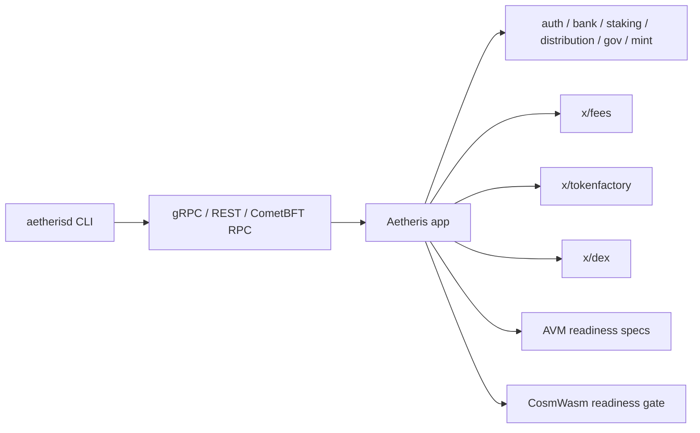

# Aetheris Blockchain

Aetheris is a sovereign Cosmos SDK Layer 1 blockchain implemented in Go. Its native token is Aetheris (`AET`), with base denom `naet` and `1 AET = 1,000,000,000 naet`. The PoS supply is uncapped: new `AET` can be issued through staking inflation and validator/delegator rewards.

This prototype is not mainnet-ready. Local Aetheris validator/full nodes do not require Redis or PostgreSQL for consensus, mempool, or app state.

## Current Surface



- `cmd/l1d`: Aetheris node binary and CLI.
- `app`: Cosmos SDK app wiring, genesis policy, custom address codec, PoS and fee configuration.
- `x/fees`: deterministic native fee-denom policy; v1 accepts only `naet` fees.
- `x/tokenfactory`: factory asset creation, mint, burn, and admin lifecycle.
- `x/dex`: local constant-product DEX module for pools, liquidity, swaps, and LP tokens.
- `x/aetherisvm`: AVM and async execution executable specifications, not yet production state mutation.
- `scripts/localnet`: local validator network initialization, startup, diagnostics, and smoke support.

The full target design for Aether Core, Execution Zones, Compute Shards, deterministic `LOAD_SCORE`, routing, Aether Mesh, Identity, security, economics, and failure handling is documented in [Aetheris Modular L1 Execution OS](docs/architecture/aetheris-modular-execution-os.md). Production zones, compute shards, Aether Mesh, AVM state mutation, and CosmWasm execution remain target architecture until implementation, simulator, long-run testnet, consensus-safety proof, and independent audit gates pass.

## Build

```powershell
.\scripts\build-aetherisd.ps1
```

The build script uses the repo-local Go toolchain under `.work\tools\go1.25.11` when present, falls back to `go` on PATH, runs `go mod verify`, and builds `build\aetherisd.exe`.

If disk space is tight, either free space on `C:\` or lower the local guard explicitly:

```powershell
.\scripts\build-aetherisd.ps1 -MinFreeGB 2
```

## Localnet

Initialize and start a 3-validator localnet:

```powershell
.\scripts\localnet\init.ps1 -ChainId aetheris-local-1 -ValidatorCount 3
.\scripts\localnet\start.ps1 -ChainId aetheris-local-1
```

Short smoke and audit probes:

```powershell
.\tests\e2e\prototype_smoke.ps1
.\scripts\security\prototype-audit.ps1 -Profile Fast
```

Default node endpoints:

- node0: P2P `26656`, RPC `26657`, gRPC `9090`, REST `1317`
- node1: P2P `26666`, RPC `26667`, gRPC `9100`, REST `1327`
- node2: P2P `26676`, RPC `26677`, gRPC `9110`, REST `1337`

Each init writes `.localnet*\localnet.json` with node homes, RPC, REST, gRPC, CometBFT metrics, and Aetheris app metrics URLs. Logs are under `.localnet*\logs`.

README keeps only the shortest probes. Use [Operator Commands](docs/operator-commands.md) for the full build, localnet, query, staking, bank, tokenfactory, DEX, diagnostics, and release command runbook.

Core runbooks:

- [Prototype Contract](docs/prototype-contract.md)
- [Operator Troubleshooting](docs/operator-troubleshooting.md)
- [Transaction Lifecycle Matrix](docs/transaction-lifecycle-matrix.md)
- [Event Contract](docs/event-contract.md)
- [Prototype Acceptance Suite](docs/prototype-acceptance-suite.md)
- [Prototype Audit Gate](docs/security/prototype-audit-gate.md)
- [Prototype Release Package](docs/release/prototype-package.md)
- [Prototype Limitations](docs/release/prototype-limitations.md)
- [Query Surface](docs/query-surface.md)
- [Observability](docs/observability.md)
- [Engineering Governance](docs/engineering-governance.md)
- [Security Testing](docs/security-testing.md)
- [Cosmos Security Checklist](docs/security/cosmos-security-checklist.md)
- [Test Pyramid](docs/test-pyramid.md)

## Common Queries

```powershell
build\aetherisd.exe query block --node tcp://127.0.0.1:26657
build\aetherisd.exe query bank denom-metadata naet --node tcp://127.0.0.1:26657 --output json
build\aetherisd.exe query bank total-supply-of naet --node tcp://127.0.0.1:26657 --output json
build\aetherisd.exe query fees params --grpc-addr 127.0.0.1:9090 --grpc-insecure --node tcp://127.0.0.1:26657 --output json
build\aetherisd.exe query dex params --node tcp://127.0.0.1:26657 --output json
build\aetherisd.exe query tokenfactory params --node tcp://127.0.0.1:26657 --output json
```

Get local keys and send native funds:

```powershell
$node0 = build\aetherisd.exe keys show node0 -a --home .localnet\node0\aetherisd --keyring-backend test
$node1 = build\aetherisd.exe keys show node1 -a --home .localnet\node1\aetherisd --keyring-backend test

build\aetherisd.exe query bank balance $node0 naet --node tcp://127.0.0.1:26657 --output json
build\aetherisd.exe tx bank send node0 $node1 1000naet `
  --home .localnet\node0\aetherisd `
  --keyring-backend test `
  --chain-id aetheris-local-1 `
  --node tcp://127.0.0.1:26657 `
  --fees 1000000naet `
  -y
```

## Token

- Name: `Aetheris`
- Symbol/display denom: `AET`
- Base denom: `naet`
- Conversion: `1 AET = 1,000,000,000 naet`
- Staking denom: `naet`
- Fee denom: `naet`
- Mint denom: `naet`
- Supply: uncapped PoS supply through inflation and rewards

Operators and scripts must use `naet` for balances, fees, staking, and tx amounts. `AET` is display metadata only.

## Fee Model

Base-chain transaction fees are native-only and capped. In v1, `allowed_fee_denoms` must be exactly `["naet"]`, delivered transactions must pay at least `1naet`, and non-`naet` fees are rejected even when the fee payer owns the token.

The protocol uses a bounded dynamic fee based on block gas utilization. Normal traffic pays the base fee (`1naet` by default), congestion raises the required fee along a deterministic curve, and the hard cap (`1000naet` by default) cannot be exceeded. Fee overpayment does not buy priority, so the system avoids Ethereum-style fee auctions.

User-created tokens, DEX LP tokens, NFT/SBT assets, `testtoken`, and display denom `AET` cannot pay protocol fees. Gasless or user-friendly flows must use relayers that pay `naet` on-chain; any alternative token collection is outside the base-chain fee path.

Spam is handled by protocol controls: max tx gas, max block gas, max block tx count, per-sender block rate limits, congestion checks, and stake-weighted priority formulas. Validators remain economically incentivized by PoS issuance and rewards rather than high transaction fees.

Localnet validator `minimum-gas-prices` may be `0naet` so development txs are not filtered before ante checks run. That mempool setting does not disable protocol fee validation for delivered transactions.

## Addresses

Aetheris uses a custom address codec for protocol-facing addresses:

- raw: `4:` followed by 64 lowercase hex characters, total length 66
- userfriendly: 48 base64url characters, starts with `AE`, alphabet `A-Z a-z 0-9 - _`
- zero address: `4:0000000000000000000000000000000000000000000000000000000000000000`

The zero address is protocol-invalid by default. It must not be a signer, admin, recipient, authority, genesis account, fee collector, DEX actor, or tokenfactory admin/recipient/source.

## Security

Aetheris currently prioritizes base-chain hardening before public testnet expansion:

- deterministic genesis validation and export/import checks
- zero-address rejection across custom modules and genesis policy
- native fee policy restricted to `naet`
- transaction replay, invalid signer, wrong chain-id, malformed tx, and insufficient funds tests
- PoS staking lifecycle tests for validator creation, delegation, unbonding, redelegation, slashing, downtime, and restart persistence
- security workflows for govulncheck, gosec, gitleaks, dependency review, and CodeQL

## AVM And CosmWasm Readiness

AVM is the Aetheris-defined native VM direction for deterministic asynchronous contracts. CosmWasm remains an explicitly gated compatibility direction. Neither runtime mutates production chain state until base-chain safety, async queue semantics, gas accounting, storage bounds, adversarial tests, fuzzing, export/import, and independent audit gates pass.

AVM contracts execute through explicit entrypoints for deploy, external call, internal call, bounced call, query, and migration. All protocol fees remain in `naet`, and AVM routing cannot bypass signer, address, zero-address, fee, memo, staking, slashing, or governance validation.

## Public Testnet

Public testnet preparation lives in [Public Testnet Preparation](docs/public-testnet-preparation.md), with validator onboarding in [Validator Onboarding](docs/validator-onboarding.md). Production zones, compute shards, Aether Mesh, and AVM state mutation remain target architecture until implementation, simulator, long-run testnet, audit, and production gates pass.
