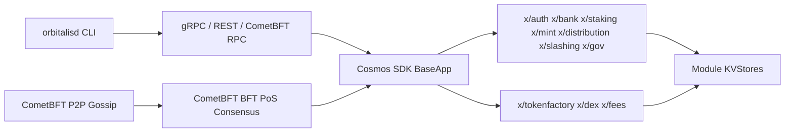

# Orbitalis Blockchain

Orbitalis is a sovereign Cosmos SDK Layer 1 blockchain implemented in Go. The native token is Orbitalis with display ticker `ORB`; the staking and fee base denom is `norb`, with `1 ORB = 1,000,000,000 norb`.

## Architecture



## Implemented

- `cmd/l1d`: Orbitalis node binary source and CLI.
- `app`: direct Cosmos SDK `BaseApp` assembly pinned to Cosmos SDK `v0.54.3` and CometBFT `v0.39.3`.
- `x/tokenfactory`: factory denoms, admin-controlled mint/burn, admin transfer, queries.
- `x/dex`: constant-product AMM pools, liquidity add/remove, exact-input swaps, LP tokens.
- `x/fees`: native fee-denom policy; v1 accepts only `norb` fees.
- `scripts/localnet`: 3-validator localnet init/start/stop/reset scripts.

## Build And Test

```powershell
$env:PATH = "$PWD\.work\tools\bin;$PWD\.work\tools\go1.25.11\go\bin;$env:PATH"
$env:GOWORK = "off"
go test -p 1 ./...
go vet -p 1 ./...
buf lint
buf generate
go build -p 1 -o build/orbitalisd.exe ./cmd/l1d
```

If you already have Go `1.25.x` on PATH, the `.work` toolchain is not required.

`buf generate` writes verification output into ignored `.work\bufgen`; checked-in generated Go code lives under `x\*\types`.

CI runs the same quality gates as separate GitHub Actions jobs:

- `unit`: `go test ./...`
- `vet`: `go vet ./...`
- `proto`: `buf lint` and generation into `.work/bufgen`
- `build`: `go build -o build/orbitalisd ./cmd/l1d`
- `e2e-localnet`: 3-validator localnet smoke and restart test
- `ci-gate`: aggregate required check; any failed, skipped, or cancelled job fails the gate

The workflow uses read-only repository permissions, pinned action revisions, Go module/build caching, and does not upload `.localnet`, validator keys, mnemonics, logs, or chain data as artifacts.

## Local 3-Node Network

```powershell
.\scripts\localnet\init.ps1
.\scripts\localnet\start.ps1
```

Ports:

- node0: P2P `26656`, RPC `26657`, gRPC `9090`, REST `1317`
- node1: P2P `26756`, RPC `26757`, gRPC `9091`, REST `1318`
- node2: P2P `26856`, RPC `26857`, gRPC `9092`, REST `1319`

Stop or reset:

```powershell
.\scripts\localnet\stop.ps1
.\scripts\localnet\reset.ps1
```

Smoke test:

```powershell
.\tests\e2e\localnet_smoke.ps1
```

## Example CLI

```powershell
build\orbitalisd.exe query block --node tcp://127.0.0.1:26657
build\orbitalisd.exe tx bank send node0 <to-address> 100000000000norb --home .localnet\node0\orbitalisd --chain-id orbitalis-local-1 --keyring-backend test --fees 1000000norb
build\orbitalisd.exe tx tokenfactory create-denom gold --home .localnet\node0\orbitalisd --chain-id orbitalis-local-1 --keyring-backend test --fees 1000000norb
build\orbitalisd.exe query fees params --node tcp://127.0.0.1:26657
```

## External Databases

Orbitalis validator/full nodes do not require Redis or PostgreSQL for consensus, mempool, or state. Use external databases only for off-chain services such as indexers, explorers, analytics, or API caching, and pass credentials through environment variables or secret managers.
